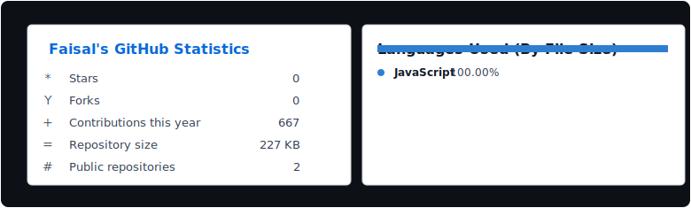
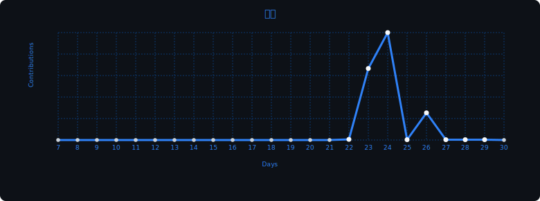

풀스택 개발자 · full-stack developer 동자바, 인도네시아


```ts
const exotickic = {
  name:     "Faisal",
  role:     "풀스택 개발자",
  based:    "east java, indonesia",
  since:    "2022",
  stack:    ["typescript","javascript","react","node"],
  language: ["id","en"],
  group:    "syncedC0de"
};
```

## 소개

인도네시아 동자바에서 활동 중인 개발자 Faisal입니다. 웹 인터페이스, 백엔드 서비스, 작은 개발 도구를 만들며 단순한 구조와 깔끔한 화면, 실제로 쓸모 있는 디테일을 좋아합니다.

## 스택

frontend


backend


tools


## 작업 중

- 개인 웹 프로젝트와 포트폴리오 실험
- 더 깔끔한 UI와 개발 경험을 위한 풀스택 앱 패턴
- 일상 개발을 더 빠르게 만드는 작은 도구

## 통계





---

<sub>generated with `npm run build`</sub>
